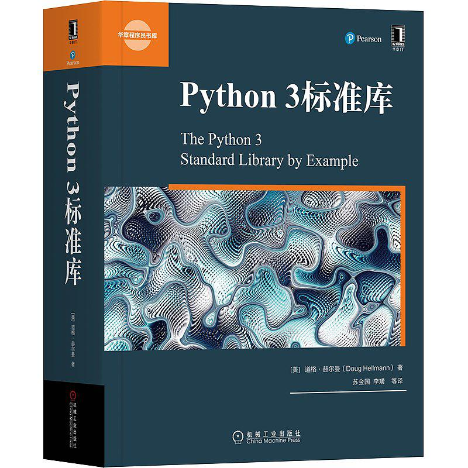
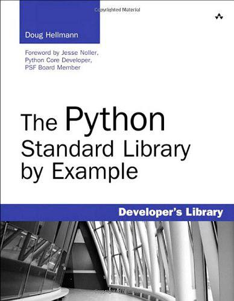

# The Python Standard Library by Example | Python3 标准库

> "The Python Standard Library by Example" ebook and source code

>《Python3 标准库》电子书和配套代码

一本又厚又全的讲解Python3标准库的书籍（1000多页）！适合当作字典参考或者闲暇时慢慢阅读。

电子书见本仓库中：`The Python Standard Library by Example.pdf`

E-book: `The Python Standard Library by Example.pdf` in this repo

## 中文版本

## 中文目录

展开查看

<pre>

* 译者序
* 前言
* 第1章 文本 1
* 1.1 string：文本常量和模板 1
* 1.1.1 函数 1
* 1.1.2 模板 2
* 1.1.3 高级模板 3
* 1.1.4 Formatter 5
* 1.1.5 常量 5
* 1.2 textwrap：格式化文本段落 6
* 1.2.1 示例数据 6
* 1.2.2 填充段落 7
* 1.2.3 去除现有的缩进 7
* 1.2.4 结合dedent和fill 8
* 1.2.5 缩进块 8
* 1.2.6 悬挂缩进 10
* 1.2.7 截断长文本 10
* 1.3 re：正则表达式 11
* 1.3.1 查找文本中的模式 11
* 1.3.2 编译表达式 12
* 1.3.3 多重匹配 13
* 1.3.4 模式语法 14
* 1.3.5 限制搜索 22
* 1.3.6 用组解析匹配 24
* 1.3.7 搜索选项 29
* 1.3.8 前向或后向 35
* 1.3.9 自引用表达式 38
* 1.3.10 用模式修改字符串 42
* 1.3.11 利用模式拆分 44
* 1.4 difflib：比较序列 46
* 1.4.1 比较文本体 47
* 1.4.2 无用数据 49
* 1.4.3 比较任意类型 50
* 第2章 数据结构 52
* 2.1 enum：枚举类型 53
* 2.1.1 创建枚举 53
* 2.1.2 迭代 53
* 2.1.3 比较Enum 54
* 2.1.4 唯一枚举值 55
* 2.1.5 通过编程创建枚举 56
* 2.1.6 非整数成员值 58
* 2.2 collections：容器数据类型 60
* 2.2.1 ChainMap：搜索多个字典 60
* 2.2.2 Counter：统计可散列的对象 63
* 2.2.3 defaultdict：缺少的键返回一个默认值 66
* 2.2.4 deque：双端队列 67
* 2.2.5 namedtuple：带命名字段的元组子类 70
* 2.2.6 OrderedDict：记住向字典中增加键的顺序 74
* 2.2.7 collections.abc：容器的抽象基类 76
* 2.3 数组：固定类型数据序列 78
* 2.3.1 初始化 78
* 2.3.2 处理数组 79
* 2.3.3 数组和文件 79
* 2.3.4 候选字节顺序 80
* 2.4 heapq：堆排序算法 81
* 2.4.1 示例数据 81
* 2.4.2 创建堆 82
* 2.4.3 访问堆的内容 83
* 2.4.4 堆的数据极值 85
* 2.4.5 高效合并有序序列 85
* 2.5 bisect：维护有序列表 86
* 2.5.1 有序插入 86
* 2.5.2 处理重复 87
* 2.6 queue：线程安全的FIFO实现 88
* 2.6.1 基本FIFO队列 88
* 2.6.2 LIFO队列 89
* 2.6.3 优先队列 89
* 2.6.4 构建一个多线程播客客户程序 90
* 2.7 struct：二进制数据结构 93
* 2.7.1 函数与Struct类 93
* 2.7.2 打包和解包 93
* 2.7.3 字节序 94
* 2.7.4 缓冲区 95
* 2.8 weakref：对象的非永久引用 96
* 2.8.1 引用 96
* 2.8.2 引用回调 97
* 2.8.3 最终化对象 98
* 2.8.4 代理 100
* 2.8.5 缓存对象 101
* 2.9 copy：复制对象 103
* 2.9.1 浅副本 103
* 2.9.2 深副本 104
* 2.9.3 定制复制行为 105
* 2.9.4 深副本中的递归 106
* 2.10 pprint：美观打印数据结构 107
* 2.10.1 打印 108
* 2.10.2 格式化 108
* 2.10.3 任意类 109
* 2.10.4 递归 110
* 2.10.5 限制嵌套输出 110
* 2.10.6 控制输出宽度 111
* 第3章 算法 113
* 3.1 functools：管理函数的工具 113
* 3.1.1 修饰符 113
* 3.1.2 比较 119
* 3.1.3 缓存 122
* 3.1.4 缩减数据集 125
* 3.1.5 泛型函数 127
* 3.2 itertools：迭代器函数 129
* 3.2.1 合并和分解迭代器 129
* 3.2.2 转换输入 132
* 3.2.3 生成新值 133
* 3.2.4 过滤 135
* 3.2.5 数据分组 138
* 3.2.6 合并输入 139
* 3.3 operator：内置操作符的函数接口 144
* 3.3.1 逻辑操作 144
* 3.3.2 比较操作符 145
* 3.3.3 算术操作符 145
* 3.3.4 序列操作符 146
* 3.3.5 原地操作符 148
* 3.3.6 属性和元素“获取方法” 148
* 3.3.7 结合操作符和定制类 150
* 3.4 contextlib：上下文管理器工具 151
* 3.4.1 上下文管理器API 151
* 3.4.2 上下文管理器作为函数修饰符 153
* 3.4.3 从生成器到上下文管理器 154
* 3.4.4 关闭打开的句柄 156
* 3.4.5 忽略异常 157
* 3.4.6 重定向输出流 158
* 3.4.7 动态上下文管理器栈 159
* 第4章 日期和时间 166
* 4.1 time：时钟时间 166
* 4.1.1 比较时钟 166
* 4.1.2 墙上时钟时间 167
* 4.1.3 单调时钟 168
* 4.1.4 处理器时钟时间 169
* 4.1.5 性能计数器 170
* 4.1.6 时间组成 170
* 4.1.7 处理时区 171
* 4.1.8 解析和格式化时间 172
* 4.2 datetime：日期和时间值管理 174
* 4.2.1 时间 174
* 4.2.2 日期 175
* 4.2.3 timedelta 177
* 4.2.4 日期算术运算 178
* 4.2.5 比较值 179
* 4.2.6 结合日期和时间 179
* 4.2.7 格式化和解析 180
* 4.2.8 时区 182
* 4.3 calendar：处理日期 183
* 4.3.1 格式化示例 183
* 4.3.2 本地化环境 185
* 4.3.3 计算日期 186
* 第5章 数学运算 188
* 5.1 decimal：定点数和浮点数的数学运算 188
* 5.1.1 Decimal 188
* 5.1.2 格式化 189
* 5.1.3 算术运算 190
* 5.1.4 特殊值 191
* 5.1.5 上下文 192
* 5.2 fractions：有理数 196
* 5.2.1 创建Fraction实例 197
* 5.2.2 算术运算 198
* 5.2.3 近似值 199
* 5.3 random：伪随机数生成器 199
* 5.3.1 生成随机数 200
* 5.3.2 指定种子 200
* 5.3.3 保存状态 201
* 5.3.4 随机整数 202
* 5.3.5 选择随机元素 203
* 5.3.6 排列 203
* 5.3.7 采样 205
* 5.3.8 多个并发生成器 205
* 5.3.9 SystemRandom 206
* 5.3.10 非均匀分布 207
* 5.4 math：数学函数 208
* 5.4.1 特殊常量 208
* 5.4.2 测试异常值 208
* 5.4.3 比较 210
* 5.4.4 将浮点值转换为整数 212
* 5.4.5 浮点值的其他表示 213
* 5.4.6 正号和负号 214
* 5.4.7 常用计算 215
* 5.4.8 指数和对数 218
* 5.4.9 角 222
* 5.4.10 三角函数 224
* 5.4.11 双曲函数 226
* 5.4.12 特殊函数 227
* 5.5 statistics：统计计算 228
* 5.5.1 平均值 228
* 5.5.2 方差 230
* 第6章 文件系统 232
* 6.1 os.path：平台独立的文件名管理 233
* 6.1.1 解析路径 233
* 6.1.2 建立路径 236
* 6.1.3 规范化路径 237
* 6.1.4 文件时间 238
* 6.1.5 测试文件 238
* 6.2 pathlib：文件系统路径作为对象 240
* 6.2.1 路径表示 240
* 6.2.2 建立路径 240
* 6.2.3 解析路径 242
* 6.2.4 创建具体路径 243
* 6.2.5 目录内容 244
* 6.2.6 读写文件 246
* 6.2.7 管理目录和符号链接 246
* 6.2.8 文件类型 247
* 6.2.9 文件属性 248
* 6.2.10 权限 250
* 6.2.11 删除 250
* 6.3 glob：文件名模式匹配 252
* 6.3.1 示例数据 252
* 6.3.2 通配符 252
* 6.3.3 单字符通配符 253
* 6.3.4 字符区间 253
* 6.3.5 转义元字符 254
* 6.4 fnmatch：UNIX式glob模式匹配 254
* 6.4.1 简单匹配 254
* 6.4.2 过滤 255
* 6.4.3 转换模式 256
* 6.5 linecache：高效读取文本文件 257
* 6.5.1 测试数据 257
* 6.5.2 读取特定行 257
* 6.5.3 处理空行 258
* 6.5.4 错误处理 258
* 6.5.5 读取Python源文件 259
* 6.6 tempfile：临时文件系统对象 260
* 6.6.1 临时文件 260
* 6.6.2 命名文件 262
* 6.6.3 假脱机文件 262
* 6.6.4 临时目录 263
* 6.6.5 预测名 264
* 6.6.6 临时文件位置 264
* 6.7 shutil：高层文件操作 265
* 6.7.1 复制文件 265
* 6.7.2 复制文件元数据 268
* 6.7.3 处理目录树 269
* 6.7.4 查找文件 271
* 6.7.5 归档 272
* 6.7.6 文件系统空间 275
* 6.8 filecmp：比较文件 276
* 6.8.1 示例数据 276
* 6.8.2 比较文件 278
* 6.8.3 比较目录 279
* 6.8.4 在程序中使用差异 280
* 6.9 mmap：内存映射文件 283
* 6.9.1 读文件 284
* 6.9.2 写文件 285
* 6.9.3 正则表达式 286
* 6.10 codecs：字符串编码和解码 287
* 6.10.1 Unicode入门 287
* 6.10.2 处理文件 289
* 6.10.3 字节序 291
* 6.10.4 错误处理 293
* 6.10.5 编码转换 295
* 6.10.6 非Unicode编码 296
* 6.10.7 增量编码 297
* 6.10.8 Unicode数据和网络通信 299
* 6.10.9 定义定制编码 301
* 6.11 io：文本、十进制和原始流I/O工具 307
* 6.11.1 内存中的流 307
* 6.11.2 为文本数据包装字节流 308
* 第7章 数据持久存储与交换 310
* 7.1 pickle：对象串行化 311
* 7.1.1 编码和解码字符串中的数据 311
* 7.1.2 处理流 312
* 7.1.3 重构对象的问题 313
* 7.1.4 不可腌制的对象 314
* 7.1.5 循环引用 316
* 7.2 shelve：对象的持久存储 318
* 7.2.1 创建一个新shelf 318
* 7.2.2 写回 319
* 7.2.3 特定shelf类型 320
* 7.3 dbm：UNIX键-值数据库 320
* 7.3.1 数据库类型 321
* 7.3.2 创建一个新数据库 321
* 7.3.3 打开一个现有数据库 322
* 7.3.4 错误情况 322
* 7.4 sqlite3：嵌入式关系数据库 323
* 7.4.1 创建数据库 323
* 7.4.2 获取数据 326
* 7.4.3 查询元数据 327
* 7.4.4 行对象 328
* 7.4.5 在查询中使用变量 329
* 7.4.6 批量加载 331
* 7.4.7 定义新的列类型 331
* 7.4.8 确定列类型 334
* 7.4.9 事务 336
* 7.4.10 隔离级别 338
* 7.4.11 内存中的数据库 341
* 7.4.12 导出数据库内容 341
* 7.4.13 在SQL中使用Python函数 342
* 7.4.14 带正则表达式的查询 344
* 7.4.15 定制聚集 345
* 7.4.16 线程和连接共享 346
* 7.4.17 限制对数据的访问 347
* 7.5 xml.etree.ElementTree：XML操纵API 349
* 7.5.1 解析XML文档 349
* 7.5.2 遍历解析树 350
* 7.5.3 查找文档中的节点 351
* 7.5.4 解析节点属性 352
* 7.5.5 解析时监视事件 354
* 7.5.6 创建一个定制树构造器 356
* 7.5.7 解析串 357
* 7.5.8 用元素节点构造文档 359
* 7.5.9 美观打印XML 359
* 7.5.10 设置元素属性 360
* 7.5.11 由节点列表构造树 362
* 7.5.12 将XML串行化至一个流 364
* 7.6 csv：逗号分隔值文件 366
* 7.6.1 读文件 366
* 7.6.2 写文件 367
* 7.6.3 方言 368
* 7.6.4 使用字段名 373
* 第8章 数据压缩与归档 375
* 8.1 zlib：GNU zlib压缩 375
* 8.1.1 处理内存中的数据 375
* 8.1.2 增量压缩与解压缩 377
* 8.1.3 混合内容流 378
* 8.1.4 校验和 378
* 8.1.5 压缩网络数据 379
* 8.2 gzip：读写GNU zip文件 382
* 8.2.1 写压缩文件 382
* 8.2.2 读压缩数据 384
* 8.2.3 处理流 385
* 8.3 bz2：bzip2压缩 386
* 8.3.1 内存中的一次性操作 386
* 8.3.2 增量压缩和解压缩 388
* 8.3.3 混合内容流 388
* 8.3.4 写压缩文件 389
* 8.3.5 读压缩文件 390
* 8.3.6 读写Unicode数据 391
* 8.3.7 压缩网络数据 392
* 8.4 tarfile：tar归档访问 395
* 8.4.1 测试tar文件 396
* 8.4.2 从归档读取元数据 396
* 8.4.3 从归档抽取文件 397
* 8.4.4 创建新归档 399
* 8.4.5 使用候选归档成员名 399
* 8.4.6 从非文件源写数据 400
* 8.4.7 追加到归档 400
* 8.4.8 处理压缩归档 401
* 8.5 zipfile：ZIP归档访问 402
* 8.5.1 测试ZIP文件 402
* 8.5.2 从归档读取元数据 402
* 8.5.3 从归档抽取归档文件 404
* 8.5.4 创建新归档 404
* 8.5.5 使用候选归档成员名 406
* 8.5.6 从非文件源写数据 406
* 8.5.7 利用ZipInfo实例写数据 407
* 8.5.8 追加到文件 407
* 8.5.9 Python ZIP归档 408
* 8.5.10 限制 410
* 第9章 加密 411
* 9.1 hashlib：密码散列 411
* 9.1.1 散列算法 411
* 9.1.2 示例数据 412
* 9.1.3 MD5示例 412
* 9.1.4 SHA1示例 412
* 9.1.5 按名创建散列 413
* 9.1.6 增量更新 413
* 9.2 hmac：密码消息签名与验证 414
* 9.2.1 消息签名 415
* 9.2.2 候选摘要类型 415
* 9.2.3 二进制摘要 416
* 9.2.4 消息签名的应用 416
* 第 10 章 使用进程、线程和协程提供并发性 420
* 10.1 subprocess：创建附加进程 420
* 10.1.1 运行外部命令 421
* 10.1.2 直接处理管道 425
* 10.1.3 连接管道段 427
* 10.1.4 与其他命令交互 428
* 10.1.5 进程间传递信号 430
* 10.2 signal：异步系统事件 434
* 10.2.1 接收信号 434
* 10.2.2 获取已注册的处理器 435
* 10.2.3 发送信号 436
* 10.2.4 闹铃 436
* 10.2.5 忽略信号 437
* 10.2.6 信号和线程 438
* 10.3 threading：进程中管理并发操作 440
* 10.3.1 Thread对象 440
* 10.3.2 确定当前线程 441
* 10.3.3 守护与非守护线程 442
* 10.3.4 枚举所有线程 444
* 10.3.5 派生线程 445
* 10.3.6 定时器线程 447
* 10.3.7 线程间传送信号 447
* 10.3.8 控制资源访问 449
* 10.3.9 同步线程 453
* 10.3.10 限制资源的并发访问 456
* 10.3.11 线程特定的数据 457
* 10.4 multiprocessing：像线程一样管理进程 459
* 10.4.1 multiprocessing基础 460
* 10.4.2 可导入的目标函数 461
* 10.4.3 确定当前进程 461
* 10.4.4 守护进程 462
* 10.4.5 等待进程 463
* 10.4.6 终止进程 465
* 10.4.7 进程退出状态 466
* 10.4.8 日志 467
* 10.4.9 派生进程 469
* 10.4.10 向进程传递消息 469
* 10.4.11 进程间信号传输 472
* 10.4.12 控制资源访问 473
* 10.4.13 同步操作 474
* 10.4.14 控制资源的并发访问 475
* 10.4.15 管理共享状态 476
* 10.4.16 共享命名空间 477
* 10.4.17 进程池 479
* 10.4.18 实现MapReduce 480
* 10.5 asyncio：异步I/O、事件循环和并发工具 484
* 10.5.1 异步并发概念 484
* 10.5.2 利用协程合作完成多任务 485
* 10.5.3 调度常规函数调用 488
* 10.5.4 异步地生成结果 490
* 10.5.5 并发地执行任务 492
* 10.5.6 组合协程和控制结构 495
* 10.5.7 同步原语 499
* 10.5.8 提供协议类抽象的异步I/O 505
* 10.5.9 使用协程和流的异步I/O 510
* 10.5.10 使用SSL 514
* 10.5.11 与域名服务交互 516
* 10.5.12 使用子进程 518
* 10.5.13 接收UNIX信号 523
* 10.5.14 结合使用协程、线程与进程 525
* 10.5.15 用asyncio调试 527
* 10.6 concurrent.futures：管理并发任务池 530
* 10.6.1 利用基本线程池使用map() 531
* 10.6.2 调度单个任务 532
* 10.6.3 按任意顺序等待任务 532
* 10.6.4 Future回调 533
* 10.6.5 撤销任务 534
* 10.6.6 任务中的异常 535
* 10.6.7 上下文管理器 536
* 10.6.8 进程池 537
* 第 11 章 网络通信 539
* 11.1 ipaddress：Internet地址 539
* 11.1.1 地址 539
* 11.1.2 网络 540
* 11.1.3 接口 543
* 11.2 socket：网络通信 544
* 11.2.1 寻址、协议簇和套接字类型 544
* 11.2.2 TCP/IP客户和服务器 552
* 11.2.3 用户数据报客户和服务器 558
* 11.2.4 UNIX域套接字 560
* 11.2.5 组播 563
* 11.2.6 发送二进制数据 566
* 11.2.7 非阻塞通信和超时 568
* 11.3 selectors：I/O多路复用抽象 568
* 11.3.1 操作模型 569
* 11.3.2 回送服务器 569
* 11.3.3 回送客户 570
* 11.3.4 服务器和客户 571
* 11.4 select：高效等待I/O 572
* 11.4.1 使用select() 572
* 11.4.2 带超时的非阻塞I/O 577
* 11.4.3 使用poll() 579
* 11.4.4 平台特定的选项 582
* 11.5 socketserver：创建网络服务器 583
* 11.5.1 服务器类型 583
* 11.5.2 服务器对象 583
* 11.5.3 实现服务器 584
* 11.5.4 请求处理器 584
* 11.5.5 回送示例 584
* 11.5.6 线程和进程 588
* 第 12 章 互联网 592
* 12.1 urllib.parse：分解URL 592
* 12.1.1 解析 593
* 12.1.2 反解析 595
* 12.1.3 连接 596
* 12.1.4 解码查询参数 597
* 12.2 urllib.request：网络资源访问 599
* 12.2.1 HTTP GET 599
* 12.2.2 编码参数 600
* 12.2.3 HTTP POST 601
* 12.2.4 添加发出首部 602
* 12.2.5 从请求提交表单数据 602
* 12.2.6 上传文件 603
* 12.2.7 创建定制协议处理器 606
* 12.3 urllib.robotparser: Internet蜘蛛访问控制 * 608
* 12.3.1 robots.txt 608
* 12.3.2 测试访问权限 609
* 12.3.3 长寿命蜘蛛 610
* 12.4 base64：用ASCII编码二进制数据 611
* 12.4.1 Base64编码 611
* 12.4.2 Base64解码 612
* 12.4.3 URL安全的变种 612
* 12.4.4 其他编码 613
* 12.5 http.server：实现Web服务器的基类 615
* 12.5.1 HTTP GET 615
* 12.5.2 HTTP POST 616
* 12.5.3 线程和进程 618
* 12.5.4 处理错误 619
* 12.5.5 设置首部 620
* 12.5.6 命令行用法 621
* 12.6 http.cookies：HTTP cookie 622
* 12.6.1 创建和设置cookie 622
* 12.6.2 Morsel 622
* 12.6.3 编码的值 624
* 12.6.4 接收和解析Cookie首部 624
* 12.6.5 候选输出格式 625
* 12.7 webbrowser：显示Web页面 626
* 12.7.1 简单示例 626
* 12.7.2 窗口与标签页 626
* 12.7.3 使用特定浏览器 627
* 12.7.4 BROWSER变量 627
* 12.7.5 命令行接口 627
* 12.8 uuid：全局唯一标识符 628
* 12.8.1 UUID 1：IEEE 802 MAC地址 628
* 12.8.2 UUID 3和5：基于名字的值 630
* 12.8.3 UUID 4：随机值 631
* 12.8.4 处理UUID对象 631
* 12.9 json：JavaScript对象记法 632
* 12.9.1 编码和解码简单数据类型 633
* 12.9.2 人类可读和紧凑输出 633
* 12.9.3 编码字典 635
* 12.9.4 处理定制类型 636
* 12.9.5 编码器和解码器类 638
* 12.9.6 处理流和文件 640
* 12.9.7 混合数据流 641
* 12.9.8 命令行上处理JSON 641
* 12.10 xmlrpc.client：XML-RPC的客户库 642
* 12.10.1 连接服务器 643
* 12.10.2 数据类型 645
* 12.10.3 传递对象 648
* 12.10.4 二进制数据 648
* 12.10.5 异常处理 650
* 12.10.6 将调用组合在一个消息中 650
* 12.11 xmlrpc.server：一个XML-RPC服务器 652
* 12.11.1 一个简单的服务器 652
* 12.11.2 候选API名 653
* 12.11.3 加点的API名 654
* 12.11.4 任意API名 655
* 12.11.5 公布对象的方法 656
* 12.11.6 分派调用 657
* 12.11.7 自省API 659
* 第 13 章 email 662
* 13.1 smtplib：简单邮件传输协议客户 662
* 13.1.1 发送email消息 662
* 13.1.2 认证和加密 663
* 13.1.3 验证email地址 666
* 13.2 smtpd：示例邮件服务器 667
* 13.2.1 邮件服务器基类 667
* 13.2.2 调试服务器 669
* 13.2.3 代理服务器 670
* 13.3 mailbox：管理email归档 670
* 13.3.1 mbox 671
* 13.3.2 Maildir 673
* 13.3.3 消息标志 678
* 13.3.4 其他格式 680
* 13.4 imaplib：IMAP4客户库 680
* 13.4.1 变种 680
* 13.4.2 连接服务器 681
* 13.4.3 示例配置 682
* 13.4.4 列出邮箱 682
* 13.4.5 邮箱状态 684
* 13.4.6 选择邮箱 686
* 13.4.7 搜索消息 686
* 13.4.8 搜索规则 687
* 13.4.9 获取消息 689
* 13.4.10 完整消息 693
* 13.4.11 上传消息 694
* 13.4.12 移动和复制消息 695
* 13.4.13 删除消息 696
* 第 14 章 应用构建模块 699
* 14.1 argparse：命令行选项和参数解析 700
* 14.1.1 建立解析器 700
* 14.1.2 定义参数 700
* 14.1.3 解析命令行 700
* 14.1.4 简单示例 701
* 14.1.5 帮助输出 707
* 14.1.6 解析器组织 711
* 14.1.7 高级参数处理 716
* 14.2 getopt：命令行选项解析 722
* 14.2.1 函数参数 722
* 14.2.2 短格式选项 723
* 14.2.3 长格式选项 723
* 14.2.4 一个完整的例子 723
* 14.2.5 缩写长格式选项 725
* 14.2.6 GNU式选项解析 725
* 14.2.7 结束参数处理 726
* 14.3 readline：GNU readline库 727
* 14.3.1 配置readline 727
* 14.3.2 完成文本 728
* 14.3.3 访问完成缓冲区 731
* 14.3.4 输入历史 733
* 14.3.5 hook 736
* 14.4 getpass：安全密码提示 737
* 14.4.1 示例 737
* 14.4.2 无终端使用getpass 738
* 14.5 cmd：面向行的命令处理器 739
* 14.5.1 处理命令 739
* 14.5.2 命令参数 740
* 14.5.3 现场帮助 741
* 14.5.4 自动完成 742
* 14.5.5 覆盖基类方法 744
* 14.5.6 通过属性配置Cmd 745
* 14.5.7 运行shell命令 746
* 14.5.8 候选输入 747
* 14.5.9 sys.argv的命令 748
* 14.6 shlex：解析shell类语法 749
* 14.6.1 解析加引号的字符串 749
* 14.6.2 为shell建立安全的字符串 751
* 14.6.3 嵌入注释 751
* 14.6.4 将字符串分解为token 752
* 14.6.5 包含其他token源 752
* 14.6.6 控制解析器 753
* 14.6.7 错误处理 755
* 14.6.8 POSIX与非POSIX解析 756
* 14.7 configparser：处理配置文件 757
* 14.7.1 配置文件格式 757
* 14.7.2 读取配置文件 758
* 14.7.3 访问配置设置 759
* 14.7.4 修改设置 765
* 14.7.5 保存配置文件 766
* 14.7.6 选项搜索路径 767
* 14.7.7 用拼接合并值 768
* 14.8 logging：报告状态、错误和信息消息 772
* 14.8.1 日志系统的组成 773
* 14.8.2 应用与库中的日志记录 773
* 14.8.3 记入文件 773
* 14.8.4 旋转日志文件 774
* 14.8.5 详细级别 774
* 14.8.6 命名日志记录器实例 776
* 14.8.7 日志树 776
* 14.8.8 与warnings模块集成 777
* 14.9 fileinput：命令行过滤器框架 778
* 14.9.1 将m3u文件转换为RSS 778
* 14.9.2 进度元数据 779
* 14.9.3 原地过滤 781
* 14.10 atexit：程序关闭回调 782
* 14.10.1 注册退出回调 782
* 14.10.2 修饰符语法 783
* 14.10.3 撤销回调 784
* 14.10.4 什么情况下不调用atexit函数 785
* 14.10.5 处理异常 786
* 14.11 sched：定时事件调度器 787
* 14.11.1 有延迟地运行事件 788
* 14.11.2 重叠事件 788
* 14.11.3 事件优先级 789
* 14.11.4 取消事件 790
* 第 15 章 国际化和本地化 791
* 15.1 gettext：消息编目 791
* 15.1.1 转换工作流概述 791
* 15.1.2 由源代码创建消息编目 792
* 15.1.3 运行时查找消息编目 794
* 15.1.4 复数值 795
* 15.1.5 应用与模块本地化 797
* 15.1.6 切换转换 798
* 15.2 locale：文化本地化API 798
* 15.2.1 探查当前本地化环境 799
* 15.2.2 货币 803
* 15.2.3 格式化数字 804
* 15.2.4 解析数字 805
* 15.2.5 日期和时间 806
* 第 16 章 开发工具 807
* 16.1 pydoc：模块的联机帮助 808
* 16.1.1 纯文本帮助 808
* 16.1.2 HTML帮助 809
* 16.1.3 交互式帮助 809
* 16.2 doctest：通过文档完成测试 810
* 16.2.1 起步 810
* 16.2.2 处理不可预测的输出 811
* 16.2.3 traceback 814
* 16.2.4 避开空白符 815
* 16.2.5 测试位置 819
* 16.2.6 外部文档 822
* 16.2.7 运行测试 824
* 16.2.8 测试上下文 827
* 16.3 unittest：自动测试框架 829
* 16.3.1 基本测试结构 829
* 16.3.2 运行测试 829
* 16.3.3 测试结果 830
* 16.3.4 断言真值 831
* 16.3.5 测试相等性 832
* 16.3.6 几乎相等？ 833
* 16.3.7 容器 833
* 16.3.8 测试异常 837
* 16.3.9 测试固件 838
* 16.3.10 用不同输入重复测试 840
* 16.3.11 跳过测试 842
* 16.3.12 忽略失败测试 842
* 16.4 trace：执行程序流 843
* 16.4.1 示例程序 843
* 16.4.2 跟踪执行 844
* 16.4.3 代码覆盖 845
* 16.4.4 调用关系 847
* 16.4.5 编程接口 848
* 16.4.6 保存结果数据 849
* 16.4.7 选项 850
* 16.5 traceback：异常和栈轨迹 850
* 16.5.1 支持函数 851
* 16.5.2 检查栈 851
* 16.5.3 traceback异常 853
* 16.5.4 底层异常API 854
* 16.5.5 底层栈API 857
* 16.6 cgitb：详细的traceback报告 859
* 16.6.1 标准traceback转储 859
* 16.6.2 启用详细的traceback 860
* 16.6.3 traceback中的局部变量 862
* 16.6.4 异常属性 864
* 16.6.5 HTML输出 866
* 16.6.6 记录traceback 866
* 16.7 pdb：交互式调试工具 868
* 16.7.1 启动调试工具 869
* 16.7.2 控制调试工具 871
* 16.7.3 断点 881
* 16.7.4 改变执行流 890
* 16.7.5 用别名定制调试工具 895
* 16.7.6 保存配置设置 897
* 16.8 profile和pstats：性能分析 898
* 16.8.1 运行性能分析工具 898
* 16.8.2 在上下文中运行 901
* 16.8.3 pstats：保存和处理统计信息 901
* 16.8.4 限制报告内容 903
* 16.8.5 调用者/被调用者图 903
* 16.9 timeit：测量小段Python代码执行的时间 905
* 16.9.1 模块内容 905
* 16.9.2 基本示例 905
* 16.9.3 将值存储在字典中 906
* 16.9.4 从命令行执行 908
* 16.10 tabnanny：缩进验证工具 909
* 16.11 compileall：字节编译源文件 910
* 16.11.1 编译一个目录 910
* 16.11.2 忽略文件 911
* 16.11.3 编译sys.path 912
* 16.11.4 编译单个文件 912
* 16.11.5 从命令行运行 913
* 16.12 pyclbr：类浏览器 914
* 16.12.1 扫描类 915
* 16.12.2 扫描函数 916
* 16.13 venv：创建虚拟环境 917
* 16.13.1 创建环境 917
* 16.13.2 虚拟环境的内容 917
* 16.13.3 使用虚拟环境 918
* 16.14 ensurepip：安装Python包安装工具 920
* 第 17 章 运行时特性 922
* 17.1 site：全站点配置 922
* 17.1.1 导入路径 922
* 17.1.2 用户目录 923
* 17.1.3 路径配置文件 924
* 17.1.4 定制站点配置 926
* 17.1.5 定制用户配置 927
* 17.1.6 禁用site模块 929
* 17.2 sys：系统特定配置 929
* 17.2.1 解释器设置 929
* 17.2.2 运行时环境 935
* 17.2.3 内存管理和限制 937
* 17.2.4 异常处理 942
* 17.2.5 底层线程支持 944
* 17.2.6 模块和导入 947
* 17.2.7 跟踪程序运行情况 963
* 17.3 os：可移植访问操作系统特定特性 968
* 17.3.1 检查文件系统内容 968
* 17.3.2 管理文件系统权限 971
* 17.3.3 创建和删除目录 973
* 17.3.4 处理符号链接 973
* 17.3.5 安全地替换现有文件 974
* 17.3.6 检测和改变进程所有者 975
* 17.3.7 管理进程环境 976
* 17.3.8 管理进程工作目录 977
* 17.3.9 运行外部命令 977
* 17.3.10 用os.fork()创建进程 979
* 17.3.11 等待子进程 980
* 17.3.12 Spawn创建新进程 982
* 17.3.13 操作系统错误码 982
* 17.4 platform：系统版本信息 983
* 17.4.1 解释器 983
* 17.4.2 平台 984
* 17.4.3 操作系统和硬件信息 985
* 17.4.4 可执行程序体系结构 986
* 17.5 resource：系统资源管理 987
* 17.5.1 当前使用情况 987
* 17.5.2 资源限制 988
* 17.6 gc：垃圾回收器 990
* 17.6.1 跟踪引用 990
* 17.6.2 强制垃圾回收 992
* 17.6.3 查找无法回收的对象引用 993
* 17.6.4 回收阈值和代 995
* 17.6.5 调试 998
* 17.7 sysconfig：解释器编译时配置 1002
* 17.7.1 配置变量 1002
* 17.7.2 安装路径 1004
* 17.7.3 Python版本和平台 1007
* 第 18 章 语言工具 1009
* 18.1 warnings：非致命警告 1009
* 18.1.1 分类和过滤 1010
* 18.1.2 生成警告 1010
* 18.1.3 用模式过滤 1011
* 18.1.4 重复的警告 1013
* 18.1.5 候选消息传送函数 1013
* 18.1.6 格式化 1014
* 18.1.7 警告中的栈层次 1014
* 18.2 abc：抽象基类 1015
* 18.2.1 ABC如何工作 1015
* 18.2.2 注册一个具体类 1016
* 18.2.3 通过派生实现 1017
* 18.2.4 辅助基类 1017
* 18.2.5 不完整的实现 1018
* 18.2.6 ABC中的具体方法 1019
* 18.2.7 抽象属性 1020
* 18.2.8 抽象类和静态方法 1022
* 18.3 dis：Python字节码反汇编工具 1023
* 18.3.1 基本反汇编 1023
* 18.3.2 反汇编函数 1024
* 18.3.3 类 1025
* 18.3.4 源代码 1026
* 18.3.5 使用反汇编调试 1027
* 18.3.6 循环的性能分析 1028
* 18.3.7 编译器优化 1033
* 18.4 inspect：检查现场对象 1035
* 18.4.1 示例模块 1035
* 18.4.2 检查模块 1035
* 18.4.3 检查类 1036
* 18.4.4 检查实例 1038
* 18.4.5 文档串 1038
* 18.4.6 获取源代码 1039
* 18.4.7 方法和函数签名 1041
* 18.4.8 类层次体系 1043
* 18.4.9 方法解析顺序 1044
* 18.4.10 栈与帧 1045
* 18.4.11 命令行接口 1047
* 第 19 章 模块和包 1048
* 19.1 importlib：Python的导入机制 1048
* 19.1.1 示例包 1048
* 19.1.2 模块类型 1049
* 19.1.3 导入模块 1049
* 19.1.4 加载工具 1051
* 19.2 pkgutil：包工具 1052
* 19.2.1 包导入路径 1052
* 19.2.2 包的开发版本 1054
* 19.2.3 用PKG文件管理路径 1055
* 19.2.4 嵌套包 1056
* 19.2.5 包数据 1058
* 19.3 zipimport：从ZIP归档加载Python代码 1060
* 19.3.1 示例 1060
* 19.3.2 查找模块 1061
* 19.3.3 访问代码 1061
* 19.3.4 源代码 1062
* 19.3.5 包 1063
* 19.3.6 数据 1063
* 附录A 移植说明 1066
* 附录B 标准库之外 1081

</pre>

## English Version

## Table of Contents

展开查看

<pre>

* Chapter 1 Text 1
* 1.1 string: Text Constants and Templates 1
* 1.1.1 Functions 1
* 1.1.2 Templates 2
* 1.1.3 Advanced Templates 4
* 1.1.4 Formatter 6
* 1.1.5 Constants 6
* 1.2 textwrap: Formatting Text Paragraphs 7
* 1.2.1 Example Data 8
* 1.2.2 Filling Paragraphs 8
* 1.2.3 Removing Existing Indentation 8
* 1.2.4 Combining Dedent and Fill 9
* 1.2.5 Indenting Blocks 10
* 1.2.6 Hanging Indents 12
* 1.2.7 Truncating Long Text 12
* 1.3 re: Regular Expressions 13
* 1.3.1 Finding Patterns in Text 14
* 1.3.2 Compiling Expressions 15
* 1.3.3 Multiple Matches 16
* 1.3.4 Pattern Syntax 17
* 1.3.5 Constraining the Search 28
* 1.3.6 Dissecting Matches with Groups 30
* 1.3.7 Search Options 36
* 1.3.8 Looking Ahead or Behind 44
* 1.3.9 Self-referencing Expressions 48
* 1.3.10 Modifying Strings with Patterns 53
* 1.3.11 Splitting with Patterns 55
* 1.4 difflib: Compare Sequences 58
* 1.4.1 Comparing Bodies of Text 58
* 1.4.2 Junk Data 61
* 1.4.3 Comparing Arbitrary Types 62
* ixx Contents
* Chapter 2 Data Structures 65
* 2.1 enum: Enumeration Type 66
* 2.1.1 Creating Enumerations 66
* 2.1.2 Iteration 67
* 2.1.3 Comparing Enums 67
* 2.1.4 Unique Enumeration Values 69
* 2.1.5 Creating Enumerations Programmatically 71
* 2.1.6 Non-integer Member Values 72
* 2.2 collections: Container Data Types 75
* 2.2.1 ChainMap: Search Multiple Dictionaries 75
* 2.2.2 Counter: Count Hashable Objects 79
* 2.2.3 defaultdict: Missing Keys Return a Default Value 83
* 2.2.4 deque: Double-Ended Queue 84
* 2.2.5 namedtuple: Tuple Subclass with Named Fields 89
* 2.2.6 OrderedDict: Remember the Order Keys Are Added to a Dictionary 94
* 2.2.7 collections.abc: Abstract Base Classes for Containers 97
* 2.3 array: Sequence of Fixed-Type Data 98
* 2.3.1 Initialization 98
* 2.3.2 Manipulating Arrays 99
* 2.3.3 Arrays and Files 100
* 2.3.4 Alternative Byte Ordering 101
* 2.4 heapq: Heap Sort Algorithm 103
* 2.4.1 Example Data 103
* 2.4.2 Creating a Heap 104
* 2.4.3 Accessing the Contents of a Heap 105
* 2.4.4 Data Extremes from a Heap 107
* 2.4.5 Efficiently Merging Sorted Sequences 108
* 2.5 bisect: Maintain Lists in Sorted Order 109
* 2.5.1 Inserting in Sorted Order 109
* 2.5.2 Handling Duplicates 110
* 2.6 queue: Thread-Safe FIFO Implementation 111
* 2.6.1 Basic FIFO Queue 112
* 2.6.2 LIFO Queue 112
* 2.6.3 Priority Queue 113
* 2.6.4 Building a Threaded Podcast Client 114
* 2.7 struct: Binary Data Structures 117
* 2.7.1 Functions Versus Struct Class 117
* 2.7.2 Packing and Unpacking 117
* 2.7.3 Endianness 118
* 2.7.4 Buffers 120
* 2.8 weakref: Impermanent References to Objects 121
* 2.8.1 References 122
* 2.8.2 Reference Callbacks 122
* 2.8.3 Finalizing Objects 123
* 2.8.4 Proxies 126
* 2.8.5 Caching Objects 127Contents xi
* 2.9 copy: Duplicate Objects 130
* 2.9.1 Shallow Copies 130
* 2.9.2 Deep Copies 131
* 2.9.3 Customizing Copy Behavior 132
* 2.9.4 Recursion in Deep Copy 133
* 2.10 pprint: Pretty-Print Data Structures 136
* 2.10.1 Printing 136
* 2.10.2 Formatting 137
* 2.10.3 Arbitrary Classes 138
* 2.10.4 Recursion 139
* 2.10.5 Limiting Nested Output 139
* 2.10.6 Controlling Output Width 140
* Chapter 3 Algorithms 143
* 3.1 functools: Tools for Manipulating Functions 143
* 3.1.1 Decorators 143
* 3.1.2 Comparison 151
* 3.1.3 Caching 155
* 3.1.4 Reducing a Data Set 158
* 3.1.5 Generic Functions 161
* 3.2 itertools: Iterator Functions 163
* 3.2.1 Merging and Splitting Iterators 164
* 3.2.2 Converting Inputs 167
* 3.2.3 Producing New Values 169
* 3.2.4 Filtering 172
* 3.2.5 Grouping Data 175
* 3.2.6 Combining Inputs 176
* 3.3 operator: Functional Interface to Built-in Operators 183
* 3.3.1 Logical Operations 183
* 3.3.2 Comparison Operators 184
* 3.3.3 Arithmetic Operators 184
* 3.3.4 Sequence Operators 186
* 3.3.5 In-Place Operators 187
* 3.3.6 Attribute and Item “Getters” 188
* 3.3.7 Combining Operators and Custom Classes 190
* 3.4 contextlib: Context Manager Utilities 191
* 3.4.1 Context Manager API 191
* 3.4.2 Context Managers as Function Decorators 194
* 3.4.3 From Generator to Context Manager 196
* 3.4.4 Closing Open Handles 198
* 3.4.5 Ignoring Exceptions 199
* 3.4.6 Redirecting Output Streams 201
* 3.4.7 Dynamic Context Manager Stacks 202xii Contents
* Chapter 4 Dates and Times 211
* 4.1 time: Clock Time 211
* 4.1.1 Comparing Clocks 211
* 4.1.2 Wall Clock Time 213
* 4.1.3 Monotonic Clocks 214
* 4.1.4 Processor Clock Time 214
* 4.1.5 Performance Counter 216
* 4.1.6 Time Components 217
* 4.1.7 Working with Time Zones 218
* 4.1.8 Parsing and Formatting Times 219
* 4.2 datetime: Date and Time Value Manipulation 221
* 4.2.1 Times 221
* 4.2.2 Dates 222
* 4.2.3 timedeltas 225
* 4.2.4 Date Arithmetic 226
* 4.2.5 Comparing Values 228
* 4.2.6 Combining Dates and Times 228
* 4.2.7 Formatting and Parsing 230
* 4.2.8 Time Zones 231
* 4.3 calendar: Work with Dates 233
* 4.3.1 Formatting Examples 233
* 4.3.2 Locales 236
* 4.3.3 Calculating Dates 236
* Chapter 5 Mathematics 239
* 5.1 decimal: Fixed- and Floating-Point Math 239
* 5.1.1 Decimal 239
* 5.1.2 Formatting 241
* 5.1.3 Arithmetic 242
* 5.1.4 Special Values 243
* 5.1.5 Context 244
* 5.2 fractions: Rational Numbers 250
* 5.2.1 Creating Fraction Instances 250
* 5.2.2 Arithmetic 252
* 5.2.3 Approximating Values 253
* 5.3 random: Pseudorandom Number Generators 254
* 5.3.1 Generating Random Numbers 254
* 5.3.2 Seeding 255
* 5.3.3 Saving State 255
* 5.3.4 Random Integers 257
* 5.3.5 Picking Random Items 258
* 5.3.6 Permutations 258
* 5.3.7 Sampling 260
* 5.3.8 Multiple Simultaneous Generators 261
* 5.3.9 SystemRandom 262
* 5.3.10 Non-uniform Distributions 263Contents xiii
* 5.4 math: Mathematical Functions 264
* 5.4.1 Special Constants 265
* 5.4.2 Testing for Exceptional Values 265
* 5.4.3 Comparing 267
* 5.4.4 Converting Floating-Point Values to Integers 270
* 5.4.5 Alternative Representations of Floating-Point Values 271
* 5.4.6 Positive and Negative Signs 272
* 5.4.7 Commonly Used Calculations 274
* 5.4.8 Exponents and Logarithms 278
* 5.4.9 Angles 282
* 5.4.10 Trigonometry 284
* 5.4.11 Hyperbolic Functions 288
* 5.4.12 Special Functions 289
* 5.5 statistics: Statistical Calculations 290
* 5.5.1 Averages 290
* 5.5.2 Variance 292
* Chapter 6 The File System 295
* 6.1 os.path: Platform-Independent Manipulation of Filenames 296
* 6.1.1 Parsing Paths 296
* 6.1.2 Building Paths 300
* 6.1.3 Normalizing Paths 301
* 6.1.4 File Times 302
* 6.1.5 Testing Files 303
* 6.2 pathlib: File System Paths as Objects 305
* 6.2.1 Path Representations 305
* 6.2.2 Building Paths 305
* 6.2.3 Parsing Paths 307
* 6.2.4 Creating Concrete Paths 309
* 6.2.5 Directory Contents 309
* 6.2.6 Reading and Writing Files 312
* 6.2.7 Manipulating Directories and Symbolic Links 312
* 6.2.8 File Types 313
* 6.2.9 File Properties 315
* 6.2.10 Permissions 317
* 6.2.11 Deleting 318
* 6.3 glob: Filename Pattern Matching 319
* 6.3.1 Example Data 320
* 6.3.2 Wildcards 320
* 6.3.3 Single-Character Wildcard 321
* 6.3.4 Character Ranges 322
* 6.3.5 Escaping Meta-characters 322
* 6.4 fnmatch: Unix-Style Glob Pattern Matching 323
* 6.4.1 Simple Matching 323
* 6.4.2 Filtering 325
* 6.4.3 Translating Patterns 325xiv Contents
* 6.5 linecache: Read Text Files Efficiently 326
* 6.5.1 Test Data 326
* 6.5.2 Reading Specific Lines 327
* 6.5.3 Handling Blank Lines 328
* 6.5.4 Error Handling 328
* 6.5.5 Reading Python Source Files 329
* 6.6 tempfile: Temporary File System Objects 330
* 6.6.1 Temporary Files 331
* 6.6.2 Named Files 333
* 6.6.3 Spooled Files 333
* 6.6.4 Temporary Directories 335
* 6.6.5 Predicting Names 335
* 6.6.6 Temporary File Location 336
* 6.7 shutil: High-Level File Operations 337
* 6.7.1 Copying Files 337
* 6.7.2 Copying File Metadata 340
* 6.7.3 Working with Directory Trees 342
* 6.7.4 Finding Files 345
* 6.7.5 Archives 346
* 6.7.6 File System Space 350
* 6.8 filecmp: Compare Files 351
* 6.8.1 Example Data 351
* 6.8.2 Comparing Files 353
* 6.8.3 Comparing Directories 355
* 6.8.4 Using Differences in a Program 357
* 6.9 mmap: Memory-Map Files 361
* 6.9.1 Reading 361
* 6.9.2 Writing 362
* 6.9.3 Regular Expressions 364
* 6.10 codecs: String Encoding and Decoding 365
* 6.10.1 Unicode Primer 365
* 6.10.2 Working with Files 368
* 6.10.3 Byte Order 370
* 6.10.4 Error Handling 372
* 6.10.5 Encoding Translation 376
* 6.10.6 Non-Unicode Encodings 377
* 6.10.7 Incremental Encoding 378
* 6.10.8 Unicode Data and Network Communication 380
* 6.10.9 Defining a Custom Encoding 383
* 6.11 io: Text, Binary, and Raw Stream I/O Tools 390
* 6.11.1 In-Memory Streams 390
* 6.11.2 Wrapping Byte Streams for Text Data 392Contents xv
* Chapter 7 Data Persistence and Exchange 395
* 7.1 pickle: Object Serialization 396
* 7.1.1 Encoding and Decoding Data in Strings 396
* 7.1.2 Working with Streams 397
* 7.1.3 Problems Reconstructing Objects 399
* 7.1.4 Unpicklable Objects 400
* 7.1.5 Circular References 402
* 7.2 shelve: Persistent Storage of Objects 405
* 7.2.1 Creating a New Shelf 405
* 7.2.2 Writeback 406
* 7.2.3 Specific Shelf Types 408
* 7.3 dbm: Unix Key–Value Databases 408
* 7.3.1 Database Types 408
* 7.3.2 Creating a New Database 409
* 7.3.3 Opening an Existing Database 410
* 7.3.4 Error Cases 411
* 7.4 sqlite3: Embedded Relational Database 412
* 7.4.1 Creating a Database 412
* 7.4.2 Retrieving Data 415
* 7.4.3 Query Metadata 417
* 7.4.4 Row Objects 417
* 7.4.5 Using Variables with Queries 419
* 7.4.6 Bulk Loading 421
* 7.4.7 Defining New Column Types 422
* 7.4.8 Determining Types for Columns 426
* 7.4.9 Transactions 428
* 7.4.10 Isolation Levels 431
* 7.4.11 In-Memory Databases 434
* 7.4.12 Exporting the Contents of a Database 435
* 7.4.13 Using Python Functions in SQL 436
* 7.4.14 Querying with Regular Expressions 439
* 7.4.15 Custom Aggregation 440
* 7.4.16 Threading and Connection Sharing 441
* 7.4.17 Restricting Access to Data 442
* 7.5 xml.etree.ElementTree: XML Manipulation API 445
* 7.5.1 Parsing an XML Document 445
* 7.5.2 Traversing the Parsed Tree 446
* 7.5.3 Finding Nodes in a Document 447
* 7.5.4 Parsed Node Attributes 449
* 7.5.5 Watching Events While Parsing 451
* 7.5.6 Creating a Custom Tree Builder 453
* 7.5.7 Parsing Strings 455
* 7.5.8 Building Documents With Element Nodes 457
* 7.5.9 Pretty-Printing XML 458
* 7.5.10 Setting Element Properties 459xvi Contents
* 7.5.11 Building Trees from Lists of Nodes 461
* 7.5.12 Serializing XML to a Stream 464
* 7.6 csv: Comma-Separated Value Files 466
* 7.6.1 Reading 466
* 7.6.2 Writing 467
* 7.6.3 Dialects 469
* 7.6.4 Using Field Names 474
* Chapter 8 Data Compression and Archiving 477
* 8.1 zlib: GNU zlib Compression 477
* 8.1.1 Working with Data in Memory 477
* 8.1.2 Incremental Compression and Decompression 479
* 8.1.3 Mixed Content Streams 480
* 8.1.4 Checksums 481
* 8.1.5 Compressing Network Data 482
* 8.2 gzip: Read and Write GNU zip Files 486
* 8.2.1 Writing Compressed Files 486
* 8.2.2 Reading Compressed Data 489
* 8.2.3 Working with Streams 490
* 8.3 bz2: bzip2 Compression 491
* 8.3.1 One-Shot Operations in Memory 492
* 8.3.2 Incremental Compression and Decompression 493
* 8.3.3 Mixed-Content Streams 494
* 8.3.4 Writing Compressed Files 495
* 8.3.5 Reading Compressed Files 497
* 8.3.6 Reading and Writing Unicode Data 498
* 8.3.7 Compressing Network Data 499
* 8.4 tarfile: Tar Archive Access 503
* 8.4.1 Testing Tar Files 503
* 8.4.2 Reading Metadata from an Archive 504
* 8.4.3 Extracting Files from an Archive 506
* 8.4.4 Creating New Archives 508
* 8.4.5 Using Alternative Archive Member Names 508
* 8.4.6 Writing Data from Sources Other Than Files 509
* 8.4.7 Appending to Archives 510
* 8.4.8 Working with Compressed Archives 510
* 8.5 zipfile: ZIP Archive Access 511
* 8.5.1 Testing ZIP Files 512
* 8.5.2 Reading Metadata from an Archive 512
* 8.5.3 Extracting Archived Files From an Archive 514
* 8.5.4 Creating New Archives 514
* 8.5.5 Using Alternative Archive Member Names 516
* 8.5.6 Writing Data from Sources Other Than Files 517
* 8.5.7 Writing with a ZipInfo Instance 517
* 8.5.8 Appending to Files 518Contents xvii
* 8.5.9 Python ZIP Archives 519
* 8.5.10 Limitations 521
* Chapter 9 Cryptography 523
* 9.1 hashlib: Cryptographic Hashing 523
* 9.1.1 Hash Algorithms 523
* 9.1.2 Sample Data 524
* 9.1.3 MD5 Example 524
* 9.1.4 SHA1 Example 525
* 9.1.5 Creating a Hash by Name 525
* 9.1.6 Incremental Updates 526
* 9.2 hmac: Cryptographic Message Signing and Verification 528
* 9.2.1 Signing Messages 528
* 9.2.2 Alternative Digest Types 528
* 9.2.3 Binary Digests 529
* 9.2.4 Applications of Message Signatures 530
* Chapter 10 Concurrency with Processes, Threads, and Coroutines 535
* 10.1 subprocess: Spawning Additional Processes 535
* 10.1.1 Running External Command 536
* 10.1.2 Working with Pipes Directly 542
* 10.1.3 Connecting Segments of a Pipe 545
* 10.1.4 Interacting with Another Command 546
* 10.1.5 Signaling Between Processes 548
* 10.2 signal: Asynchronous System Events 553
* 10.2.1 Receiving Signals 554
* 10.2.2 Retrieving Registered Handlers 555
* 10.2.3 Sending Signals 556
* 10.2.4 Alarms 556
* 10.2.5 Ignoring Signals 557
* 10.2.6 Signals and Threads 558
* 10.3 threading: Manage Concurrent Operations Within a Process 560
* 10.3.1 Thread Objects 560
* 10.3.2 Determining the Current Thread 562
* 10.3.3 Daemon Versus Non-daemon Threads 564
* 10.3.4 Enumerating All Threads 567
* 10.3.5 Subclassing Thread 568
* 10.3.6 Timer Threads 570
* 10.3.7 Signaling Between Threads 571
* 10.3.8 Controlling Access to Resources 572
* 10.3.9 Synchronizing Threads 578
* 10.3.10 Limiting Concurrent Access to Resources 581
* 10.3.11 Thread Specific Data 583
* 10.4 multiprocessing: Manage Processes Like Threads 586
* 10.4.1 multiprocessing Basics 586
* 10.4.2 Importable Target Functions 587xviii Contents
* 10.4.3 Determining the Current Process 588
* 10.4.4 Daemon Processes 589
* 10.4.5 Waiting for Processes 591
* 10.4.6 Terminating Processes 593
* 10.4.7 Process Exit Status 594
* 10.4.8 Logging 596
* 10.4.9 Subclassing Process 597
* 10.4.10 Passing Messages to Processes 598
* 10.4.11 Signaling Between Processes 602
* 10.4.12 Controlling Access to Resources 603
* 10.4.13 Synchronizing Operations 604
* 10.4.14 Controlling Concurrent Access to Resources 605
* 10.4.15 Managing Shared State 608
* 10.4.16 Shared Namespaces 608
* 10.4.17 Process Pools 611
* 10.4.18 Implementing MapReduce 613
* 10.5 asyncio: Asynchronous I/O, Event Loop, and Concurrency Tools 617
* 10.5.1 Asynchronous Concurrency Concepts 618
* 10.5.2 Cooperative Multitasking with Coroutines 618
* 10.5.3 Scheduling Calls to Regular Functions 622
* 10.5.4 Producing Results Asynchronously 625
* 10.5.5 Executing Tasks Concurrently 628
* 10.5.6 Composing Coroutines with Control Structures 632
* 10.5.7 Synchronization Primitives 637
* 10.5.8 Asynchronous I/O with Protocol Class Abstractions 644
* 10.5.9 Asynchronous I/O Using Coroutines and Streams 650
* 10.5.10 Using SSL 656
* 10.5.11 Interacting with Domain Name Services 658
* 10.5.12 Working with Subprocesses 661
* 10.5.13 Receiving Unix Signals 668
* 10.5.14 Combining Coroutines with Threads and Processes 670
* 10.5.15 Debugging with asyncio 673
* 10.6 concurrent.futures: Manage Pools of Concurrent Tasks 677
* 10.6.1 Using map() with a Basic Thread Pool 677
* 10.6.2 Scheduling Individual Tasks 678
* 10.6.3 Waiting for Tasks in Any Order 679
* 10.6.4 Future Callbacks 680
* 10.6.5 Canceling Tasks 681
* 10.6.6 Exceptions in Tasks 683
* 10.6.7 Context Manager 683
* 10.6.8 Process Pools 684Contents xix
* Chapter 11 Networking 687
* 11.1 ipaddress: Internet Addresses 687
* 11.1.1 Addresses 687
* 11.1.2 Networks 688
* 11.1.3 Interfaces 692
* 11.2 socket: Network Communication 693
* 11.2.1 Addressing, Protocol Families, and Socket Types 693
* 11.2.2 TCP/IP Client and Server 704
* 11.2.3 User Datagram Client and Server 711
* 11.2.4 Unix Domain Sockets 714
* 11.2.5 Multicast 717
* 11.2.6 Sending Binary Data 721
* 11.2.7 Non-blocking Communication and Timeouts 723
* 11.3 selectors: I/O Multiplexing Abstractions 724
* 11.3.1 Operating Model 724
* 11.3.2 Echo Server 724
* 11.3.3 Echo Client 726
* 11.3.4 Server and Client Together 727
* 11.4 select: Wait for I/O Efficiently 728
* 11.4.1 Using select() 729
* 11.4.2 Non-blocking I/O with Timeouts 734
* 11.4.3 Using poll() 737
* 11.4.4 Platform-Specific Options 742
* 11.5 socketserver: Creating Network Servers 742
* 11.5.1 Server Types 742
* 11.5.2 Server Objects 743
* 11.5.3 Implementing a Server 743
* 11.5.4 Request Handlers 743
* 11.5.5 Echo Example 744
* 11.5.6 Threading and Forking 749
* Chapter 12 The Internet 753
* 12.1 urllib.parse: Split URLs into Components 753
* 12.1.1 Parsing 754
* 12.1.2 Unparsing 756
* 12.1.3 Joining 758
* 12.1.4 Encoding Query Arguments 759
* 12.2 urllib.request: Network Resource Access 761
* 12.2.1 HTTP GET 761
* 12.2.2 Encoding Arguments 763
* 12.2.3 HTTP POST 764
* 12.2.4 Adding Outgoing Headers 765
* 12.2.5 Posting Form Data from a Request 766
* 12.2.6 Uploading Files 767
* 12.2.7 Creating Custom Protocol Handlers 770xx Contents
* 12.3 urllib.robotparser: Internet Spider Access Control 773
* 12.3.1 robots.txt 773
* 12.3.2 Testing Access Permissions 774
* 12.3.3 Long-Lived Spiders 775
* 12.4 base64: Encode Binary Data with ASCII 776
* 12.4.1 Base 64 Encoding 777
* 12.4.2 Base64 Decoding 778
* 12.4.3 URL-Safe Variations 778
* 12.4.4 Other Encodings 779
* 12.5 http.server: Base Classes for Implementing Web Servers 781
* 12.5.1 HTTP GET 781
* 12.5.2 HTTP POST 784
* 12.5.3 Threading and Forking 786
* 12.5.4 Handling Errors 787
* 12.5.5 Setting Headers 788
* 12.5.6 Command-Line Use 789
* 12.6 http.cookies: HTTP Cookies 790
* 12.6.1 Creating and Setting a Cookie 790
* 12.6.2 Morsels 791
* 12.6.3 Encoded Values 793
* 12.6.4 Receiving and Parsing Cookie Headers 794
* 12.6.5 Alternative Output Formats 795
* 12.7 webbrowser: Displays Web Pages 796
* 12.7.1 Simple Example 796
* 12.7.2 Windows Versus Tabs 796
* 12.7.3 Using a Specific Browser 796
* 12.7.4 BROWSER Variable 797
* 12.7.5 Command-Line Interface 797
* 12.8 uuid: Universally Unique Identifiers 797
* 12.8.1 UUID 1: IEEE 802 MAC Address 798
* 12.8.2 UUID 3 and 5: Name-Based Values 800
* 12.8.3 UUID 4: Random Values 802
* 12.8.4 Working with UUID Objects 802
* 12.9 json: JavaScript Object Notation 803
* 12.9.1 Encoding and Decoding Simple Data Types 804
* 12.9.2 Human-Consumable Versus Compact Output 805
* 12.9.3 Encoding Dictionaries 807
* 12.9.4 Working with Custom Types 807
* 12.9.5 Encoder and Decoder Classes 810
* 12.9.6 Working with Streams and Files 813
* 12.9.7 Mixed Data Streams 813
* 12.9.8 JSON at the Command Line 815
* 12.10 xmlrpc.client: Client Library for XML-RPC 816
* 12.10.1 Connecting to a Server 817
* 12.10.2 Data Types 819Contents xxi
* 12.10.3 Passing Objects 822
* 12.10.4 Binary Data 823
* 12.10.5 Exception Handling 825
* 12.10.6 Combining Calls into One Message 826
* 12.11 xmlrpc.server: An XML-RPC Server 827
* 12.11.1 A Simple Server 828
* 12.11.2 Alternate API Names 829
* 12.11.3 Dotted API Names 830
* 12.11.4 Arbitrary API Names 831
* 12.11.5 Exposing Methods of Objects 832
* 12.11.6 Dispatching Calls 834
* 12.11.7 Introspection API 837
* Chapter 13 Email 841
* 13.1 smtplib: Simple Mail Transfer Protocol Client 841
* 13.1.1 Sending an Email Message 841
* 13.1.2 Authentication and Encryption 843
* 13.1.3 Verifying an Email Address 846
* 13.2 smtpd: Sample Mail Servers 847
* 13.2.1 Mail Server Base Class 847
* 13.2.2 Debugging Server 850
* 13.2.3 Proxy Server 851
* 13.3 mailbox: Manipulate Email Archives 852
* 13.3.1 mbox 852
* 13.3.2 Maildir 855
* 13.3.3 Message Flags 862
* 13.3.4 Other Formats 864
* 13.4 imaplib: IMAP4 Client Library 864
* 13.4.1 Variations 864
* 13.4.2 Connecting to a Server 864
* 13.4.3 Example Configuration 866
* 13.4.4 Listing Mailboxes 866
* 13.4.5 Mailbox Status 869
* 13.4.6 Selecting a Mailbox 871
* 13.4.7 Searching for Messages 872
* 13.4.8 Search Criteria 872
* 13.4.9 Fetching Messages 874
* 13.4.10 Whole Messages 880
* 13.4.11 Uploading Messages 881
* 13.4.12 Moving and Copying Messages 883
* 13.4.13 Deleting Messages 884xxii Contents
* Chapter 14 Application Building Blocks 887
* 14.1 argparse: Command-Line Option and Argument Parsing 888
* 14.1.1 Setting Up a Parser 888
* 14.1.2 Defining Arguments 888
* 14.1.3 Parsing a Command Line 889
* 14.1.4 Simple Examples 889
* 14.1.5 Help Output 897
* 14.1.6 Parser Organization 901
* 14.1.7 Advanced Argument Processing 908
* 14.2 getopt: Command-Line Option Parsing 916
* 14.2.1 Function Arguments 916
* 14.2.2 Short-Form Options 917
* 14.2.3 Long-Form Options 917
* 14.2.4 A Complete Example 918
* 14.2.5 Abbreviating Long-Form Options 920
* 14.2.6 GNU-Style Option Parsing 920
* 14.2.7 Ending Argument Processing 922
* 14.3 readline: The GNU readline Library 922
* 14.3.1 Configuring readline 923
* 14.3.2 Completing Text 924
* 14.3.3 Accessing the Completion Buffer 927
* 14.3.4 Input History 931
* 14.3.5 Hooks 934
* 14.4 getpass: Secure Password Prompt 935
* 14.4.1 Example 935
* 14.4.2 Using getpass Without a Terminal 937
* 14.5 cmd: Line-Oriented Command Processors 938
* 14.5.1 Processing Commands 938
* 14.5.2 Command Arguments 940
* 14.5.3 Live Help 941
* 14.5.4 Auto-Completion 942
* 14.5.5 Overriding Base Class Methods 944
* 14.5.6 Configuring Cmd Through Attributes 946
* 14.5.7 Running Shell Commands 947
* 14.5.8 Alternative Inputs 948
* 14.5.9 Commands from sys.argv 950
* 14.6 shlex: Parse Shell-Style Syntaxes 951
* 14.6.1 Parsing Quoted Strings 951
* 14.6.2 Making Safe Strings for Shells 953
* 14.6.3 Embedded Comments 954
* 14.6.4 Splitting Strings into Tokens 954
* 14.6.5 Including Other Sources of Tokens 955
* 14.6.6 Controlling the Parser 956
* 14.6.7 Error Handling 957
* 14.6.8 POSIX Versus Non-POSIX Parsing 959Contents xxiii
* 14.7 configparser: Work with Configuration Files 960
* 14.7.1 Configuration File Format 961
* 14.7.2 Reading Configuration Files 961
* 14.7.3 Accessing Configuration Settings 963
* 14.7.4 Modifying Settings 970
* 14.7.5 Saving Configuration Files 972
* 14.7.6 Option Search Path 972
* 14.7.7 Combining Values with Interpolation 975
* 14.8 logging: Report Status, Error, and Informational Messages 980
* 14.8.1 Logging Components 980
* 14.8.2 Logging in Applications Versus Libraries 980
* 14.8.3 Logging to a File 981
* 14.8.4 Rotating Log Files 981
* 14.8.5 Verbosity Levels 982
* 14.8.6 Naming Logger Instances 984
* 14.8.7 The Logging Tree 984
* 14.8.8 Integration with the warnings Module 985
* 14.9 fileinput: Command-Line Filter Framework 986
* 14.9.1 Converting M3U Files to RSS 987
* 14.9.2 Progress Metadata 989
* 14.9.3 In-Place Filtering 990
* 14.10 atexit: Program Shutdown Callbacks 993
* 14.10.1 Registering Exit Callbacks 993
* 14.10.2 Decorator Syntax 994
* 14.10.3 Canceling Callbacks 994
* 14.10.4 When Are atexit Callbacks Not Called? 995
* 14.10.5 Handling Exceptions 997
* 14.11 sched: Timed Event Scheduler 998
* 14.11.1 Running Events with a Delay 999
* 14.11.2 Overlapping Events 1000
* 14.11.3 Event Priorities 1001
* 14.11.4 Canceling Events 1001
* Chapter 15 Internationalization and Localization 1003
* 15.1 gettext: Message Catalogs 1003
* 15.1.1 Translation Workflow Overview 1003
* 15.1.2 Creating Message Catalogs from Source Code 1004
* 15.1.3 Finding Message Catalogs at Runtime 1007
* 15.1.4 Plural Values 1008
* 15.1.5 Application Versus Module Localization 1011
* 15.1.6 Switching Translations 1012
* 15.2 locale: Cultural Localization API 1012
* 15.2.1 Probing the Current Locale 1013
* 15.2.2 Currency 1018
* 15.2.3 Formatting Numbers 1019xxiv Contents
* 15.2.4 Parsing Numbers 1021
* 15.2.5 Dates and Times 1022
* Chapter 16 Developer Tools 1023
* 16.1 pydoc: Online Help for Modules 1024
* 16.1.1 Plain Text Help 1024
* 16.1.2 HTML Help 1025
* 16.1.3 Interactive Help 1026
* 16.2 doctest: Testing Through Documentation 1026
* 16.2.1 Getting Started 1026
* 16.2.2 Handling Unpredictable Output 1028
* 16.2.3 Tracebacks 1032
* 16.2.4 Working Around Whitespace 1034
* 16.2.5 Test Locations 1039
* 16.2.6 External Documentation 1042
* 16.2.7 Running Tests 1044
* 16.2.8 Test Context 1048
* 16.3 unittest: Automated Testing Framework 1051
* 16.3.1 Basic Test Structure 1051
* 16.3.2 Running Tests 1051
* 16.3.3 Test Outcomes 1052
* 16.3.4 Asserting Truth 1054
* 16.3.5 Testing Equality 1054
* 16.3.6 Almost Equal? 1055
* 16.3.7 Containers 1056
* 16.3.8 Testing for Exceptions 1061
* 16.3.9 Test Fixtures 1062
* 16.3.10 Repeating Tests with Different Inputs 1065
* 16.3.11 Skipping Tests 1066
* 16.3.12 Ignoring Failing Tests 1068
* 16.4 trace: Follow Program Flow 1069
* 16.4.1 Example Program 1069
* 16.4.2 Tracing Execution 1069
* 16.4.3 Code Coverage 1070
* 16.4.4 Calling Relationships 1073
* 16.4.5 Programming Interface 1074
* 16.4.6 Saving Result Data 1076
* 16.4.7 Options 1077
* 16.5 traceback: Exceptions and Stack Traces 1078
* 16.5.1 Supporting Functions 1079
* 16.5.2 Examining the Stack 1079
* 16.5.3 TracebackException 1081
* 16.5.4 Low-Level Exception APIs 1082
* 16.5.5 Low-Level Stack APIs 1086Contents xxv
* 16.6 cgitb: Detailed Traceback Reports 1089
* 16.6.1 Standard Traceback Dumps 1089
* 16.6.2 Enabling Detailed Tracebacks 1090
* 16.6.3 Local Variables in Tracebacks 1093
* 16.6.4 Exception Properties 1096
* 16.6.5 HTML Output 1098
* 16.6.6 Logging Tracebacks 1098
* 16.7 pdb: Interactive Debugger 1101
* 16.7.1 Starting the Debugger 1101
* 16.7.2 Controlling the Debugger 1104
* 16.7.3 Breakpoints 1117
* 16.7.4 Changing Execution Flow 1129
* 16.7.5 Customizing the Debugger with Aliases 1136
* 16.7.6 Saving Configuration Settings 1137
* 16.8 profile and pstats: Performance Analysis 1140
* 16.8.1 Running the Profiler 1140
* 16.8.2 Running in a Context 1143
* 16.8.3 pstats: Saving and Working with Statistics 1144
* 16.8.4 Limiting Report Contents 1145
* 16.8.5 Caller/Callee Graphs 1146
* 16.9 timeit: Time the Execution of Small Bits of Python Code 1148
* 16.9.1 Module Contents 1148
* 16.9.2 Basic Example 1148
* 16.9.3 Storing Values in a Dictionary 1149
* 16.9.4 From the Command Line 1152
* 16.10 tabnanny: Indentation Validator 1153
* 16.10.1 Running from the Command Line 1153
* 16.11 compileall: Byte-Compile Source Files 1155
* 16.11.1 Compiling One Directory 1155
* 16.11.2 Ignoring Files 1156
* 16.11.3 Compiling sys.path 1157
* 16.11.4 Compiling Individual Files 1157
* 16.11.5 From the Command Line 1158
* 16.12 pyclbr: Class Browser 1160
* 16.12.1 Scanning for Classes 1161
* 16.12.2 Scanning for Functions 1162
* 16.13 venv: Create Virtual Environments 1163
* 16.13.1 Creating Environments 1163
* 16.13.2 Contents of a Virtual Environment 1164
* 16.13.3 Using Virtual Environments 1165
* 16.14 ensurepip: Install the Python Package Installer 1167
* 16.14.1 Installing pip 1167xxvi Contents
* Chapter 17 Runtime Features 1169
* 17.1 site: Site-wide Configuration 1169
* 17.1.1 Import Path 1169
* 17.1.2 User Directories 1171
* 17.1.3 Path Configuration Files 1172
* 17.1.4 Customizing Site Configuration 1175
* 17.1.5 Customizing User Configuration 1176
* 17.1.6 Disabling the site Module 1177
* 17.2 sys: System-Specific Configuration 1178
* 17.2.1 Interpreter Settings 1178
* 17.2.2 Runtime Environment 1185
* 17.2.3 Memory Management and Limits 1187
* 17.2.4 Exception Handling 1194
* 17.2.5 Low-Level Thread Support 1197
* 17.2.6 Modules and Imports 1200
* 17.2.7 Tracing a Program As It Runs 1221
* 17.3 os: Portable Access to Operating System–Specific Features 1227
* 17.3.1 Examining the File System Contents 1228
* 17.3.2 Managing File System Permissions 1230
* 17.3.3 Creating and Deleting Directories 1233
* 17.3.4 Working with Symbolic Links 1234
* 17.3.5 Safely Replacing an Existing File 1234
* 17.3.6 Detecting and Changing the Process Owner 1235
* 17.3.7 Managing the Process Environment 1237
* 17.3.8 Managing the Process Working Directory 1238
* 17.3.9 Running External Commands 1239
* 17.3.10 Creating Processes with os.fork() 1240
* 17.3.11 Waiting for Child Processes 1242
* 17.3.12 Spawning New Processes 1244
* 17.3.13 Operating System Error Codes 1245
* 17.4 platform: System Version Information 1246
* 17.4.1 Interpreter 1246
* 17.4.2 Platform 1247
* 17.4.3 Operating System and Hardware Information 1248
* 17.4.4 Executable Architecture 1250
* 17.5 resource: System Resource Management 1251
* 17.5.1 Current Usage 1251
* 17.5.2 Resource Limits 1252
* 17.6 gc: Garbage Collector 1254
* 17.6.1 Tracing References 1255
* 17.6.2 Forcing Garbage Collection 1258
* 17.6.3 Finding References to Objects That Cannot Be Collected 1259
* 17.6.4 Collection Thresholds and Generations 1261
* 17.6.5 Debugging 1265Contents xxvii
* 17.7 sysconfig: Interpreter Compile-Time Configuration 1270
* 17.7.1 Configuration Variables 1270
* 17.7.2 Installation Paths 1272
* 17.7.3 Python Version and Platform 1276
* Chapter 18 Language Tools 1279
* 18.1 warnings: Non-fatal Alerts 1279
* 18.1.1 Categories and Filtering 1280
* 18.1.2 Generating Warnings 1280
* 18.1.3 Filtering with Patterns 1281
* 18.1.4 Repeated Warnings 1283
* 18.1.5 Alternative Message Delivery Functions 1284
* 18.1.6 Formatting 1285
* 18.1.7 Stack Level in Warnings 1286
* 18.2 abc: Abstract Base Classes 1287
* 18.2.1 How ABCs Work 1287
* 18.2.2 Registering a Concrete Class 1287
* 18.2.3 Implementation Through Subclassing 1288
* 18.2.4 Helper Base Class 1289
* 18.2.5 Incomplete Implementations 1290
* 18.2.6 Concrete Methods in ABCs 1291
* 18.2.7 Abstract Properties 1292
* 18.2.8 Abstract Class and Static Methods 1295
* 18.3 dis: Python Byte-Code Disassembler 1296
* 18.3.1 Basic Disassembly 1297
* 18.3.2 Disassembling Functions 1297
* 18.3.3 Classes 1300
* 18.3.4 Source Code 1301
* 18.3.5 Using Disassembly to Debug 1302
* 18.3.6 Performance Analysis of Loops 1303
* 18.3.7 Compiler Optimizations 1309
* 18.4 inspect: Inspect Live Objects 1311
* 18.4.1 Example Module 1311
* 18.4.2 Inspecting Modules 1312
* 18.4.3 Inspecting Classes 1314
* 18.4.4 Inspecting Instances 1316
* 18.4.5 Documentation Strings 1316
* 18.4.6 Retrieving Source 1318
* 18.4.7 Method and Function Signatures 1319
* 18.4.8 Class Hierarchies 1322
* 18.4.9 Method Resolution Order 1323
* 18.4.10 The Stack and Frames 1324
* 18.4.11 Command-Line Interface 1327xxviii Contents
* Chapter 19 Modules and Packages 1329
* 19.1 importlib: Python’s Import Mechanism 1329
* 19.1.1 Example Package 1329
* 19.1.2 Module Types 1330
* 19.1.3 Importing Modules 1331
* 19.1.4 Loaders 1332
* 19.2 pkgutil: Package Utilities 1334
* 19.2.1 Package Import Paths 1334
* 19.2.2 Development Versions of Packages 1336
* 19.2.3 Managing Paths with PKG Files 1338
* 19.2.4 Nested Packages 1340
* 19.2.5 Package Data 1341
* 19.3 zipimport: Load Python Code from ZIP Archives 1344
* 19.3.1 Example 1344
* 19.3.2 Finding a Module 1345
* 19.3.3 Accessing Code 1345
* 19.3.4 Source 1346
* 19.3.5 Packages 1348
* 19.3.6 Data 1348
* Appendix A Porting Notes 1351
* A.1 References 1351
* A.2 New Modules 1352
* A.3 Renamed Modules 1352
* A.4 Removed Modules 1354
* A.4.1 bsddb 1354
* A.4.2 commands 1354
* A.4.3 compiler 1354
* A.4.4 dircache 1354
* A.4.5 EasyDialogs 1354
* A.4.6 exceptions 1354
* A.4.7 htmllib 1354
* A.4.8 md5 1354
* A.4.9 mimetools, MimeWriter, mimify, multifile, and rfc822 1354
* A.4.10 popen2 1354
* A.4.11 posixfile 1355
* A.4.12 sets 1355
* A.4.13 sha 1355
* A.4.14 sre 1355
* A.4.15 statvfs 1355
* A.4.16 thread 1355
* A.4.17 user 1355
* A.5 Deprecated Modules 1355
* A.5.1 asyncore and asynchat 1355
* A.5.2 formatter 1355Contents xxix
* A.5.3 imp 1356
* A.5.4 optparse 1356
* A.6 Summary of Changes to Modules 1356
* A.6.1 abc 1356
* A.6.2 anydbm 1356
* A.6.3 argparse 1356
* A.6.4 array 1357
* A.6.5 atexit 1357
* A.6.6 base64 1357
* A.6.7 bz2 1357
* A.6.8 collections 1357
* A.6.9 comands 1357
* A.6.10 configparser 1358
* A.6.11 contextlib 1358
* A.6.12 csv 1358
* A.6.13 datetime 1358
* A.6.14 decimal 1358
* A.6.15 fractions 1358
* A.6.16 gc 1358
* A.6.17 gettext 1359
* A.6.18 glob 1359
* A.6.19 http.cookies 1359
* A.6.20 imaplib 1359
* A.6.21 inspect 1359
* A.6.22 itertools 1359
* A.6.23 json 1359
* A.6.24 locale 1359
* A.6.25 logging 1360
* A.6.26 mailbox 1360
* A.6.27 mmap 1360
* A.6.28 operator 1360
* A.6.29 os 1360
* A.6.30 os.path 1361
* A.6.31 pdb 1361
* A.6.32 pickle 1361
* A.6.33 pipes 1362
* A.6.34 platform 1362
* A.6.35 random 1362
* A.6.36 re 1362
* A.6.37 shelve 1362
* A.6.38 signal 1362
* A.6.39 socket 1362
* A.6.40 socketserver 1363
* A.6.41 string 1363
* A.6.42 struct 1363xxx Contents
* A.6.43 subprocess 1363
* A.6.44 sys 1363
* A.6.45 threading 1364
* A.6.46 time 1364
* A.6.47 unittest 1364
* A.6.48 UserDict, UserList, and UserString 1365
* A.6.49 uuid 1365
* A.6.50 whichdb 1365
* A.6.51 xml.etree.ElementTree 1365
* A.6.52 zipimport 1365
* Appendix B Outside of the Standard Library 1367
* B.1 Text 1367
* B.2 Algorithms 1367
* B.3 Dates and Times 1368
* B.4 Mathematics 1368
* B.5 Data Persistence and Exchange 1368
* B.6 Cryptography 1369
* B.7 Concurrency with Processes, Threads, and Coroutines 1369
* B.8 The Internet 1369
* B.9 Email 1370
* B.10 Application Building Blocks 1370
* B.11 Developer Tools 1371

</pre>

